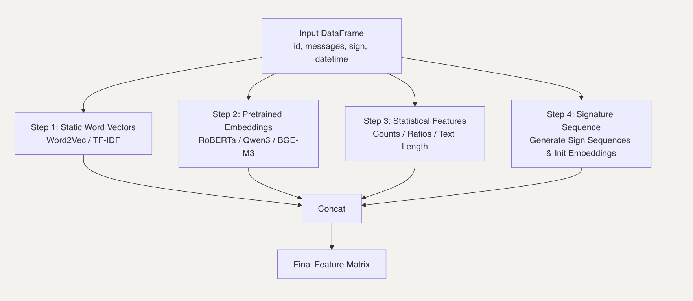

# SMS2Vec


## Project Overview
SMS2Vec is an engineering-oriented pipeline framework for vectorizing text information such as SMS and emails. It is a practical solution for transforming raw text records into feature vectors for downstream machine learning tasks. The framework combines statistical word vectors (TF-IDF, Word2Vec), pretrained language model embeddings (RoBERTa, Qwen3, BGE-M3), statistical features, and sequential SMS signature features, enabling flexible feature engineering and supporting large-scale data processing in real-world scenarios.

Typical use cases include:
- User interest modeling for ad targeting and recommendation recall
- Binary classification of user text records (e.g., spam detection, intent prediction)
- Feature engineering from raw text and signature sequences for downstream models



## Environment

This project requires **Python 3.10**.

## Installation
Install dependencies with:
```bash
pip install -r requirements.txt
```

## Data Format
Input CSV files should contain columns such as:

| id | message | sign | datetime | label |
|----|---------|------|----------|-------|
| ...| ...     | ...  | ...      | ...   |

ID can be duplicated, and each row contain an unique message record.

## Usage

You can run the entire pipeline by executing `example_main.py`, which covers:

1. Data preprocessing
2. Model training
3. Inference (prediction)

#### Steps

1. Prepare your raw data files (e.g. `data/raw/train_data.csv` and `data/raw/predict_data.csv`) and configure `processing_config.yaml` as needed.
2. Install dependencies:
	```bash
	pip install -r requirements.txt
	```

3. Run the main program:
	```bash
	python example_main.py
	```

The program will automatically:
- Preprocess data (encryption, filtering, feature engineering, etc.)
- Train a deep learning model (DNN, with optional signature sequence features)
- Run inference on prediction data and output results

For custom workflows, refer to `example_main.py` and modules in the `src/` directory.
- Deep learning model training: MLP with flexible architecture
- Easy-to-modify configuration via YAML and Python scripts
- Supports large-scale data and chunked processing

## Directory Structure
- `example_main.py`: Data preprocessing/Trainer entry
- `src/`: Core modules (config, data processing, training, logging, etc.)
- `model/`: Model files and deep learning modules
- `data/`: Raw, processed, and prediction data
- `requirements.txt`: Python dependencies


## Experiment Records

SMS2Vec provides a three-layer DNN as a baseline model, which demonstrates strong performance on industrial datasets. Notably, the inclusion of SMS signature sequence features leads to significant improvements on the validation set.

| Method                                 | Val Acc | F1    | Recall | AUC    | KS     | Loss   |
|-----------------------------------------|---------|-------|--------|--------|--------|--------|
| Qwen3 Embedding + Word2Vec + MLP      | 0.7438  | 0.5196| 0.4243 | 0.8306 | 0.5120 | 0.5095 |
| Qwen3 Embedding + Word2Vec + Sign Seq + MLP| 0.8333  | 0.7011| 0.5989 | 0.9196 | 0.6543 | 0.2377 |

*Note: Experiment based on an small industrial dataset containing 89,248 message records from 31,296 users.*

*"Sign Seq" refers to signature ID sequence features.*

